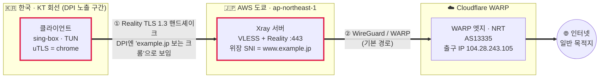
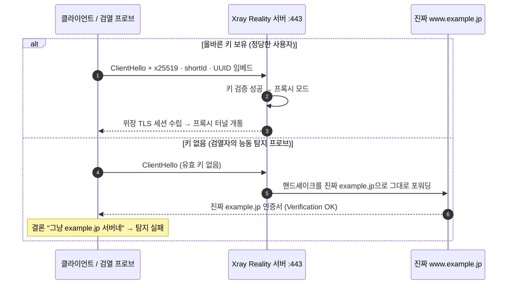
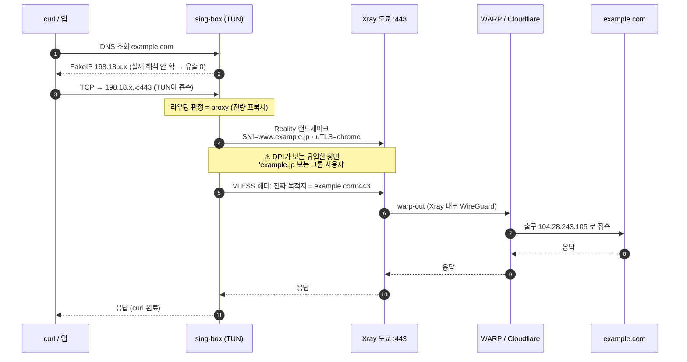

> ℹ️ **예시값 안내**: 이 글의 **서버 IP(`203.0.113.10`)·위장 SNI 도메인(`www.example.jp`)·Reality 공개키·shortId·클라이언트 UUID는 모두 문서용 예시값**임(IP는 RFC 5737 문서 전용 대역 `203.0.113.0/24`, 도메인은 JPRS가 문서용으로 예약한 `example.jp`). 직접 구축할 때 본인의 실제 값으로 교체하면 됨. **개인키(privateKey/secretKey)는 절대 외부에 공개하지 말 것.** PoC에 나오는 **인증서·SNI 바이트는 이 예시 도메인 기준의 설명용 값**임(실제로는 본인이 고른 위장 도메인의 진짜 인증서가 그대로 반환됨). 반면 **출구 IP·성능 수치·트래픽 흐름은 실제 환경에서 뽑은 실측값**이며, 출구 IP는 수많은 사용자가 공유하는 Cloudflare WARP 대역이라 서버나 개인을 특정하지 못함.

## 1. 자유롭게 인터넷을 사용하기 위한 여정

동기는 단순함. **안전하고 자유롭게, 익명으로 인터넷을 사용하고 싶음.** 그래서 VLESS + Xray + Reality + WARP 를 활용한 프록시 시스템을 구축하였고 3개월간 운용한 내용을 바탕으로 작성하였음.

한국의 인터넷 규제는 해가 갈수록 촘촘해짐 — 차단은 이미 DNS 수준을 넘어 **접속 목적지 이름(SNI)을 평문으로 들여다보는 단계**까지 왔고, 그 범위는 계속 넓어짐. 한국만의 이야기도 아님. 중국의 만리방화벽(GFW), 러시아의 "주권 인터넷"은 이 길을 훨씬 앞서감. 그리고 이 모든 곳에서 벌어지는 건 끝나지 않는 **창과 방패의 싸움**임 — 누군가 규제를 뚫으면 그걸 막는 새 규제가 생기고, 다시 그걸 뚫는 방법이 나옴. 여기서 힌트를 얻을 수 있음.

일단, 현대의 검열이 어떻게 작동하는지부터 알아야 함. 요즘 검열은 "해당 도메인을 차단" 같은 단순 블랙리스트가 아님. ISP의 미들박스는 **트래픽의 "모양"을 보고 판단**함:

1. **패킷 시그니처** — 프로토콜 고유의 지문을 식별함 (WireGuard 핸드셰이크는 고정 구조라 한 방에 걸림).
2. **평문 SNI** — TLS 접속의 목적지 이름을 그대로 읽음.
3. **행동 패턴** — 누구인지 모를 IP로 향하는, 브라우징 같지 않은 긴수명(long-lived) 세션을 이상치로 플래깅함.

조짐은 이미 보임. 한국에서 자가 VPN을 며칠 돌려보면 **지속되는 TLS 세션만 골라서** 툭툭 끊기고(EOF), WireGuard·OpenVPN은 핸드셰이크 단계에서부터 막히곤 함. 대역폭 문제가 아니라, 트래픽의 "모양"이 평범한 사용자와 다르기 때문임.

그래서 목표는 명확함.

> **"검열자가 내 트래픽을 봤을 때, 그냥 평범한 사람이 유명 사이트를 HTTPS로 보는 것과 1비트도 구분되지 않게 만든다."**

이 "구분 불가능성"을 만들어주는 게 **Reality**임. 그리고 여기에 **누가 어디서 접속하는지**까지 지우려고, 최종 출구를 **Cloudflare WARP**로 한 번 더 익명화함. 누구에게도 감시받거나 통제받지 않고, 그냥 인터넷을 쓰기 위해서.

> 📎 **참고** — [*How I Hid My VPN*](https://youtu.be/v7Pal3AQyVM)

---

## 2. 전체 아키텍처



**핵심 설계 2가지:**

1. **검열받는 구간(클라이언트 ↔ 도쿄 서버)** 은 Reality로 감싸 *유명 일본 사이트로 가는 정상 TLS 1.3*으로 위장한다.
2. **검열받지 않는 구간(도쿄 서버 ↔ Cloudflare)** 에서만 WireGuard(WARP)를 쓴다. → WireGuard의 지문 문제를 검열망에 노출하지 않고 "출구 IP 세탁" 이득만 취한다.

> **왜 WARP를 뒤에 두나?** 최종 목적지 서버가 보는 IP가 **AWS(AS16509)** 가 아니라 **Cloudflare(AS13335)** 가 됨. AWS 대역은 "데이터센터 = 봇/프록시 의심"으로 차단당하기 쉽지만, WARP 엣지 IP는 수많은 실사용자가 공유하는 소비자 대역이라 평판이 좋음. **내 서버 IP조차 최종 목적지에 노출되지 않는다**는 게 핵심.

---

## 3. 기존 WireGuard VPN의 약점

WireGuard는 빠르고 코드가 작고 암호학적으로 우수하지만, **검열 회피 도구로는 치명적인 약점**들이 있음.

| 약점 | 설명 | DPI가 하는 일 |
|---|---|---|
| **고정된 핸드셰이크 지문** | Handshake Initiation이 **정확히 148바이트**, 뒤이어 Responder는 **정확히 92바이트**. 매 패킷 첫 4바이트에 메시지 타입(`0x01` init, `0x02` response …)이 그대로. 난독화가 전혀 없음. | `148바이트 → 92바이트 UDP 흐름` 규칙 하나로 거의 모든 WireGuard 핸드셰이크를 포착 |
| **UDP 기반** | 많은 검열망/기업망이 443/UDP를 아예 throttle 하거나, QUIC 아닌 미식별 UDP를 drop. | 프로토콜 몰라도 "UDP 대량 장수명" 자체를 차단 |
| **능동 탐지(active probing)에 취약** | 아무나 WG 핸드셰이크를 던져보면 서버가 반응하거나(응답) 침묵함 → 응답 패턴으로 서버 식별 가능. | 의심 IP:포트에 프로브 패킷 발사 → VPN 서버 확정 후 블랙리스트 |
| **위장·커버 트래픽 없음** | SNI 위장, 인증서 위장, 정상 트래픽 mimicry 개념 자체가 없음. 포트를 443으로 바꿔도 페이로드가 TLS가 아니라서 바로 티남. | "443인데 TLS가 아님" → 이상치 플래깅 |
| **키 노출 시 즉시 식별** | 트래픽에 프로토콜 정체성이 그대로 드러나므로, 한 번 지목되면 그 엔드포인트는 영구 차단. | IP 평판 DB에 등재 |

2026년 기준 Sandvine·Allot·Huawei의 상용 DPI 장비는 **WireGuard 탐지 규칙을 기본 탑재**하며, 최신 미들박스는 패킷 100개만으로 타이밍·엔트로피 기반 ML 분류로 WireGuard를 복호화 없이 식별함. 실제 차단 성적표도 참혹함 — **러시아에서 순정 WireGuard 성공률 약 12%, 이란 98% 패킷 손실, 중국 GFW는 수 초 내 포착**, 그 외 터키·벨라루스·미얀마 등 10개국+가 DPI 레벨에서 차단/스로틀 중임.

> 이 때문에 **AmneziaWG** 같은 "난독화 WireGuard" 파생이 등장함. 순정 WireGuard의 고정 패킷 크기에 랜덤 정크·가변 헤더를 덧대 시그니처를 흩뜨리는 방식인데, *"WireGuard는 그대로 쓰면 잡힌다"*는 사실을 업계가 인정했다는 방증임. 이 글의 Reality는 한 발 더 나아가 **"난독화된 무언가"가 아니라 아예 "정상 TLS 그 자체"로** 보이게 함.

**요약**: WireGuard는 *"나는 WireGuard입니다"* 라고 큰 소리로 외치며 접속함. 검열자는 들을 귀만 있으면 됨. 반면 Reality는 *"저는 그냥 example.jp 보는 사람인데요"* 라고 말하고, **그 증거로 진짜 example.jp의 TLS 인증서까지 제시**함(아래 4·5장에서 실증).

---

## 4. 구성요소

### 4.1 VLESS

VLESS는 VMess의 후속으로, **자체 암호화·타임스탬프 인증을 들어냄.** 왜? 어차피 바깥을 TLS 1.3(Reality)로 감쌀 거라 이중 암호화는 CPU 낭비이기 때문. VLESS 헤더는 버전 바이트 · UUID · 명령 · 목적지 주소 정도로 구성된 **25~50바이트짜리 얇은 라우팅 헤더**에 불과함(OpenVPN 100바이트+ 대비). 여기에 `xtls-rprx-vision` flow를 얹어 TLS-in-TLS로 생기는 특유의 레코드 크기 패턴까지 눌러줌.

> 📎 **참고** — VLESS를 "TLS 1.3 최소 래퍼"로 바이트 단위 해부하고, DPI의 3대 탐지 기법(프로토콜 핑거프린팅 · 통계 분석 · 능동 탐지)을 정리한 글: [habr.com/en/articles/990144](https://habr.com/en/articles/990144/). (1·3장)

### 4.2 Xray-core — 서버 엔진

서버에서 실제로 도는 것은 Xray.

```console
$ xray version
Xray 26.3.27 (Xray, Penetrates Everything.) — go1.26.1 linux/amd64
$ ps -o etime,cmd -C xray
   ELAPSED CMD
30-13:49:26 /usr/local/bin/xray run -config /usr/local/etc/xray/config.json   # 30일 무중단
```

`nobody` 권한으로 30일째 무중단 가동.

### 4.3 Reality — 이 구조의 심장

기존 TLS 위장(TLS+웹서버, 예: Trojan)의 근본 문제는 **"내가 제시하는 인증서가 진짜가 아니다"** 임. 검열자가 Certificate Transparency 로그를 뒤지거나 인증서 체인을 검증하면 자작 도메인이 들통남.

**Reality의 발상 전환:**

- 내 서버는 인증서를 **직접 발급/제시하지 않음.**
- 대신 **실존하는 유명 사이트(여기선 `www.example.jp`)를 "빌려옴".**
- 정당한 클라이언트(올바른 x25519 키 + shortId 보유)가 접속하면 → Xray가 프록시 모드로 동작.
- **키가 없는 아무나(=검열자의 능동 탐지 프로브)가 접속하면 → Xray가 그 핸드셰이크를 진짜 `www.example.jp:443`으로 그대로 포워딩**하고, 클라이언트는 example.jp의 진짜 인증서를 받음.

이 "정당한 사용자 ↔ 검열 프로브"의 분기를 그림으로 보면:



즉 검열자가 아무리 찔러봐도 **"여긴 그냥 example.jp 서버네"** 라는 결론밖에 못 냄.

> 📎 **참고 (Reality 원리)** — 공식 구현 [XTLS/REALITY](https://github.com/XTLS/REALITY), SNI fallback 위장 문서 [Project X — Fallbacks with SNI](https://xtls.github.io/en/document/level-1/fallbacks-with-sni.html), 소스 레벨 분석 [How REALITY works (ObjShadow)](https://objshadow.pages.dev/en/posts/how-reality-works/). 능동 탐지 방어 논의는 [Xray-core Discussion #2623](https://github.com/XTLS/Xray-core/discussions/2623).

**서버 inbound 설정:**

```jsonc
{
  "tag": "vless-reality-in",
  "listen": "0.0.0.0", "port": 443,
  "protocol": "vless",
  "settings": {
    "clients": [{ "id": "<클라이언트-UUID>", "flow": "xtls-rprx-vision" }],
    "decryption": "none"
  },
  "streamSettings": {
    "network": "tcp",
    "security": "reality",
    "realitySettings": {
      "dest": "www.example.jp:443",        // 위장 대상(진짜로 여기로 포워딩)
      "serverNames": ["www.example.jp"],   // 허용 SNI
      "privateKey": "<xray-x25519-개인키>",   // 절대 공개 금지
      "shortIds": ["", "0123456789abcdef"]
    }
  },
  "sniffing": { "enabled": true, "destOverride": ["http","tls","quic"], "routeOnly": true }
}
```

> **위장 대상(dest) 선정 기준** — 아무 사이트나 되는 게 아님. ① TLS 1.3 + X25519를 지원하고, ② 서버와 **같은 클라우드/ASN/리전**에 있어야 자연스러움. 도쿄 AWS 서버라면 **AWS에 호스팅된(→인증서 발급자가 `Amazon`으로 잡히는) 일본 대형 사이트**를 고르면 위장이 한층 자연스러움(서버와 같은 클라우드·ASN). 이 글에서는 위장 도메인을 문서용 예시 `www.example.jp`로 표기함. 실제로 KT DPI가 프록시 IP를 플래깅했을 때, SNI를 **서버와 같은 리전·ASN의 호스트**로 맞추는 것이 안정성에 결정적.

### 4.4 WARP outbound — 출구 세탁

서버의 기본 출구는 `direct`(AWS IP 노출)가 아니라 **Cloudflare WARP(userspace WireGuard)**.

```jsonc
{
  "tag": "warp-out",
  "protocol": "wireguard",
  "settings": {
    "secretKey": "<WARP-개인키>",
    "address": ["172.16.0.2/32", "2606:4700:110:84e7:...../128"],
    "peers": [{
      "publicKey": "bmXOC+F1FxEMF9dyiK2H5/1SUtzH0JuVo51h2wPfgyo=",
      "endpoint": "engage.cloudflareclient.com:2408",
      "allowedIPs": ["0.0.0.0/0", "::/0"],
      "keepAlive": 25
    }],
    "mtu": 1280
  }
}
```

여기서 중요한 점: **이 WireGuard는 Xray 내부의 userspace 구현**이라 커널 인터페이스(`wg show`)로 안 보이고, **AWS↔Cloudflare 구간(검열 없는 해외 구간)에서만** 흐름. 즉 WireGuard의 지문 문제를 한국 검열망에 절대 노출하지 않으면서 "출구 IP = Cloudflare"라는 이득만 챙김.

### 4.5 라우팅 — 하드닝

```jsonc
"routing": {
  "rules": [
    { "ip": ["geoip:private"], "outboundTag": "block" },      // SSRF/내부망 스캔 차단
    { "protocol": ["bittorrent"], "outboundTag": "block" },   // 남용 방지(IP 평판 보호)
    { "ip": ["203.0.113.10/32"], "port": "22",   "outboundTag": "loopback-ssh" },      // 관리용
    { "ip": ["203.0.113.10/32"], "port": "8080", "outboundTag": "loopback-speedtest" },
    { "network": "tcp,udp", "outboundTag": "warp-out" }       // 나머지 전부 → WARP
  ]
}
```

- **`geoip:private` → block**: 프록시를 통해 내부망을 스캔하는 SSRF류를 원천 차단.
- **bittorrent → block**: 토렌트로 인한 abuse 신고가 WARP/AWS IP 평판을 죽이는 것을 방지.
- **loopback-ssh**: 별도 포트를 여는 대신, 프록시 터널 안으로 서버 자신의 22에 접근(관리 트래픽도 위장된 채로).

### 4.6 클라이언트 — sing-box (TUN + FakeIP)

클라이언트는 sing-box를 TUN 모드로 돌려 **시스템 전체 트래픽**을 투명하게 삼킴.

```jsonc
{
  "outbounds": [{
    "type": "vless",
    "server": "203.0.113.10", "server_port": 443,
    "uuid": "<클라이언트-UUID>",
    "flow": "xtls-rprx-vision",
    "tls": {
      "enabled": true,
      "server_name": "www.example.jp",
      "reality": { "enabled": true,
        "public_key": "<서버-Reality-공개키>",
        "short_id": "0123456789abcdef" },
      "utls": { "enabled": true, "fingerprint": "chrome" }   // ← Chrome처럼 위장
    }
  }],
  "dns": { "servers": [
    { "tag": "proxy-dns", "type": "https", "server": "1.1.1.1", "detour": "proxy" },  // DoH를 프록시 너머에서
    { "tag": "fakeip", "type": "fakeip", "inet4_range": "198.18.0.0/15" }             // DNS 유출 방지
  ]}
}
```

두 가지가 특히 중요함.

- **`utls: chrome`** — TLS ClientHello를 진짜 크롬 브라우저의 지문과 동일하게 생성함(뒤에서 패킷으로 증명). uTLS는 [refraction-networking/utls](https://github.com/refraction-networking/utls) 라이브러리로, Go 표준 TLS의 티나는 지문 대신 특정 브라우저 지문을 흉내 냄.
- **FakeIP + DoH-over-proxy** — 도메인을 로컬에서 절대 해석하지 않음. `198.18.x` 가짜 IP를 즉시 반환하고 실제 해석은 프록시 건너편에서 일어나므로 **DNS 유출이 0**임.

---

## 5. PoC — 패킷 단위로 증명

**실제 커맨드와 실제 응답**. 검열자의 세 가지 관점(① 출구 IP 추적, ② 능동 탐지, ③ 수동 패킷 관찰)에서 각각 뚫리는지 검증.

### PoC-1. 출구 IP 세탁 확인

```console
$ curl -s https://api.ipify.org
104.28.243.105

$ curl -s https://www.cloudflare.com/cdn-cgi/trace | grep -E '^(ip|warp|colo|loc)='
ip=2a09:bac5:4305:dc::16:175
colo=NRT
loc=JP
warp=on

$ curl -s "http://ip-api.com/line/?fields=query,country,city,isp,as"
104.28.243.105
Japan
Tokyo
Cloudflare, Inc.
AS13335 Cloudflare, Inc.
```

**해석:**

| 관점 | 실제 값 | 목적지가 보는 값 |
|---|---|---|
| 내 진짜 위치 | 한국, KT | ❌ 안 보임 |
| 프록시 서버 | `203.0.113.10` (AWS, **AS16509**, 도쿄) | ❌ 안 보임 |
| **목적지가 보는 출구** | — | ✅ `104.28.243.105` (**Cloudflare AS13335**, 도쿄) |

`warp=on`이 WARP 경유를 확정함. 3단 홉(한국→프록시 서버→WARP)을 거쳤는데 최종 목적지는 **Cloudflare 소비자 대역**만 봄. **프록시 서버 IP 노출되지 않음.**

### PoC-2. 능동 탐지 저항 — "찔러봐도 그냥 example.jp"

검열자가 의심 IP `203.0.113.10:443`에 직접 붙어본다고 가정함. 자격증명이 없는 openssl로 접속:

```console
$ echo | openssl s_client -connect 203.0.113.10:443 -servername www.example.jp 2>/dev/null \
      | openssl x509 -noout -subject -issuer -dates
subject=CN=www.example.jp
issuer=C=US, O=Amazon, CN=Amazon RSA 2048 M01
notBefore=Jan 19 00:00:00 2026 GMT
notAfter=Jan 14 23:59:59 2027 GMT

# 비교: 진짜 www.example.jp 직접 접속
$ echo | openssl s_client -connect www.example.jp:443 -servername www.example.jp 2>/dev/null \
      | openssl x509 -noout -subject -issuer
subject=CN=www.example.jp
issuer=C=US, O=Amazon, CN=Amazon RSA 2048 M01

# TLS 파라미터
$ echo | openssl s_client -connect 203.0.113.10:443 -servername www.example.jp 2>/dev/null \
      | grep -E 'Protocol|Cipher|Verification'
Verification: OK
New, TLSv1.3, Cipher is TLS_AES_128_GCM_SHA256
Protocol: TLSv1.3
```

**해석: 완벽하게 동일.**

- 프록시 서버가 돌려준 인증서: `CN=www.example.jp`, 발급자 `Amazon RSA 2048 M01`.
- 진짜 example.jp가 돌려주는 인증서: **완전히 같음.**
- `Verification: OK` — 자작 인증서였다면 체인 검증에 실패했겠지만, **진짜 example.jp의 진짜 인증서**이므로 검증을 통과함.

검열자가 이 IP를 아무리 능동 탐지해도 얻는 결론은 **"여기는 example.jp 서버다"** 뿐임. WireGuard 서버였다면 프로브 한 번에 정체가 드러났을 것.

### PoC-3. 수동 관찰 — DPI가 와이어에서 실제로 읽는 바이트

이번엔 검열자가 회선 중간에서 패킷을 그냥 훔쳐본다고 가정함. 클라이언트의 물리 NIC(`eth0`)에서 서버로 나가는 트래픽을 `tshark`로 캡처하고, 그동안 여러 사이트에 curl을 날려 **새 업스트림 연결(=새 Reality 핸드셰이크)** 을 유발함.

```console
$ tshark -i eth0 -f "host 203.0.113.10 and tcp port 443" -w reality.pcap &
$ for h in example.com www.wikipedia.org api.ipify.org neverssl.com; do
      curl -s -o /dev/null "https://$h/?cachebust=$RANDOM"; done
```

**(3-a) DPI가 보는 SNI와 TLS 버전:**

```console
$ tshark -r reality.pcap -Y "tls.handshake.type==1" \
    -T fields -e frame.number -e ip.dst -e tcp.dstport \
    -e tls.handshake.extensions_server_name -e tls.handshake.ja3_full
```

| frame | ip.dst | port | SNI | 확장(extension) 순서 |
|---|---|---|---|---|
| 31  | 203.0.113.10 | 443 | **www.example.jp** | `0-45-17613-16-11-35-18-5-27-51-13-23-10-65037-65281-43` |
| 73  | 203.0.113.10 | 443 | **www.example.jp** | `18-35-65281-16-11-17613-65037-5-13-43-51-45-10-23-0-27` |
| 118 | 203.0.113.10 | 443 | **www.example.jp** | `16-23-0-51-13-10-18-5-11-27-17613-45-65037-43-35-65281` |
| 186 | 203.0.113.10 | 443 | **www.example.jp** | `65037-23-43-27-16-51-45-18-5-13-35-10-0-65281-11-17613` |

관찰 두 가지:

1. **SNI가 전부 `www.example.jp`** — DPI가 평문으로 읽어낼 수 있는 유일한 목적지 힌트가 "example.jp"임. 실제로 나는 example.com·wikipedia·ipify로 갔지만, **와이어 위에는 그 흔적이 없음.**
2. **확장 순서가 매 연결마다 셔플됨** — 이건 우연이 아니라 **Chrome 110+ 의 실제 동작(extension 순서 랜덤화)** 을 uTLS가 그대로 흉내낸 것임. 시작 cipher suite도 `4865-4866-4867`(TLS 1.3 AEAD 3종)로 크롬과 동일. 즉 JA3 지문이 연결마다 바뀌어 **"고정 지문 매칭"으로는 절대 못 잡음.** 확장 목록에는 `65037`(GREASE ECH), `17613`(ALPS), `27`(compress_certificate) 등 크롬 고유 확장까지 다 들어있음.

**(3-b) 와이어 바이트 — SNI 호스트명이 평문으로 박힘:**

```console
# ClientHello 안 SNI 확장의 호스트명 바이트 (frame 31)
0e 77 77 77 2e 65 78 61 6d 70 6c 65 2e 6a 70   ->  "www.example.jp"  (0e = 길이 14)
```

길이 바이트 `0e`(14) 다음에 `77 77 77 2e 65 78 61 6d 70 6c 65 2e 6a 70` = **"www.example.jp"** 가 그대로 평문으로 실림. **이것이 DPI가 회선에서 읽는 전부** — 정상적인 크롬 사용자가 example.jp를 여는 것과 바이트 수준에서 동일함.

### PoC-4. 성능

3단 홉(한국→도쿄 Reality→Cloudflare WARP)을 거치는데도 실사용 성능은 준수함.

```console
$ for i in 1 2 3; do curl -s -o /dev/null \
    -w "ttfb=%{time_starttransfer}s total=%{time_total}s\n" \
    https://www.cloudflare.com/cdn-cgi/trace; done
ttfb=0.234s total=0.235s
ttfb=0.258s total=0.259s
ttfb=0.258s total=0.258s

$ curl -s -o /dev/null -w "speed=%{speed_download} bytes/s\n" \
    "https://speed.cloudflare.com/__down?bytes=10000000"
speed=7615746 bytes/s        # ≈ 61 Mbps (10MB in 1.31s)
```

- **TTFB ≈ 235–260 ms** (한국↔도쿄 왕복 + WARP 홉 포함). 브라우징 체감 지장 없음.
- **다운로드 ≈ 61 Mbps** (단일 스트림, 3홉). VLESS가 이중 암호화를 걷어내고 `xtls-rprx-vision`으로 오버헤드를 줄인 덕.

---

## 6. 전체 여정 (엔드-투-엔드)

`curl https://example.com` 을 쳤을 때 실제로 일어나는 일을 시퀀스로 보면:



단계별 상세:

1. **DNS** — sing-box가 `example.com`을 가로채 **FakeIP `198.18.x.x`** 를 즉시 반환(실제 해석 안 함 → 유출 0).
2. **TUN 흡수** — 목적지 `198.18.x.x`로 향하는 패킷을 `singbox-tun`이 삼킴.
3. **라우팅 판정** — `final: proxy`, 전량 프록시로 보냄.
4. **Reality 핸드셰이크** — sing-box가 서버 `203.0.113.10:443`에 접속. **uTLS로 크롬 지문의 ClientHello 생성**, SNI=`www.example.jp`. x25519 키교환에 shortId·UUID를 실어 서버에 "정당한 클라이언트"임을 증명. ← **DPI는 여기서 example.jp 접속으로만 봄.**
5. **VLESS 라우팅** — 터널 안에서 "진짜 목적지는 example.com:443"을 서버에 전달.
6. **서버 라우팅** — Xray가 `warp-out` 선택.
7. **WARP 송출** — Xray 내부 WireGuard가 Cloudflare 엣지(NRT)로 패킷 전달.
8. **최종 출구** — Cloudflare가 `104.28.243.105`로 example.com에 접속. **origin은 Cloudflare IP만 봄.**
9. **역경로** — 응답이 8→1 역순으로 돌아와 curl에 도착.

검열자가 보는 것: **4번 한 장면뿐**, 그것도 "example.jp 보는 크롬 사용자".

---

## 7. 한계와 운영상 고려사항

해당 구조의 약점과 보완할점.

- **트래픽 상관분석(correlation)**: 검열자가 회선 양단을 다 본다면 타이밍/볼륨 상관으로 추론 여지는 남음. Reality는 콘텐츠·목적지를 가릴 뿐, 메타데이터 상관까지 막지는 못함.
- **위장 도메인 리스크**: `dest`로 고른 사이트가 죽거나 TLS 스택을 바꾸면 위장이 어색해짐. 서버와 같은 ASN/리전 유지가 중요.
- **IP 평판**: WARP 출구는 공유 IP라 일부 사이트가 WARP 대역을 차단/캡차함. 그래서 토렌트를 block해 IP 평판을 관리함.
- **능동 프로브의 정교화**: 검열자가 "정당한 example.jp 사용자라면 하지 않을 행동"(예: 접속 후 HTTP 요청을 안 보냄)을 통계적으로 볼 여지. Reality는 이를 상당히 방어하지만 이론적 표면은 존재.
- **단일 실패점**: 도쿄 서버 하나. 다중 서버 + 자동 페일오버는 향후 과제.

그럼에도, **평범한 WireGuard/OpenVPN 대비 검열 회피 관점에서 압도적**임. WireGuard가 "첫 패킷에 정체가 드러나는" 반면, 이 구조는 **패킷·인증서·핑거프린트 어느 층위에서도 정상 트래픽과 구분되지 않음**을 위 PoC로 실증함.

---

## 8. 결론

> **검열 회피의 본질은 암호화가 아니라 "구분 불가능성(indistinguishability)"임.**

WireGuard는 트래픽을 완벽히 암호화하지만, *암호화됐다는 사실 자체*를 숨기지 못해 잡힘. Reality는 반대로, 내 트래픽을 **검열자가 절대 차단할 수 없는 무언가(유명 사이트로 가는 평범한 TLS 1.3)로 만듦**으로써 살아남음. 여기에 WARP를 얹어 출구 IP까지 세탁함.

- **출구 IP** → Cloudflare(내 서버 IP조차 은닉) ✅
- **능동 탐지** → 진짜 example.jp 인증서로 응답 ✅
- **수동 관찰** → 평문 SNI가 `www.example.jp`, 크롬 uTLS 지문(연결마다 셔플) ✅
- **성능** → TTFB 250ms, 61Mbps ✅

DPI와의 싸움은 결국 *"내 트래픽이 검열자가 차마 못 끊을 정상 트래픽과 얼마나 똑같아 보이느냐"* 의 게임이고, 이 구조는 그 게임에서 이기도록 설계됨.

---

## 참고자료 (References)

**개념**
- 🎬 [*How I Hid My VPN* (YouTube)](https://youtu.be/v7Pal3AQyVM) — "암호화가 아니라 은닉" 관점의 개념 소개
- 📄 [VLESS 심층 해부 (Habr #990144)](https://habr.com/en/articles/990144/) — VLESS를 TLS 최소 래퍼로 분석, DPI 3대 탐지 기법

**Reality / XTLS**
- [XTLS/REALITY (공식 저장소)](https://github.com/XTLS/REALITY)
- [Project X — Fallbacks with SNI (공식 문서)](https://xtls.github.io/en/document/level-1/fallbacks-with-sni.html)
- [How REALITY works — 소스 레벨 분석 (ObjShadow)](https://objshadow.pages.dev/en/posts/how-reality-works/)
- [능동 탐지 방어 논의 — Xray-core Discussion #2623](https://github.com/XTLS/Xray-core/discussions/2623)
- [VLESS + Reality + XTLS Vision 심화 (Hakim Mhioul)](https://www.mhioul.com/blog/vless-reality-xtls-deep-dive)

**클라이언트 / 라이브러리 / 출구**
- [sing-box 공식 문서](https://sing-box.sagernet.org)
- [uTLS — refraction-networking/utls](https://github.com/refraction-networking/utls) (브라우저 TLS 지문 위장)
- [Cloudflare WARP 클라이언트 문서](https://developers.cloudflare.com/warp-client/)

**WireGuard의 탐지 가능성 (대조군)**
- [The Imitation Game — WireGuard를 DPI에 안 보이게 만들기 (NT Kernel)](https://www.ntkernel.com/the-imitation-game-how-modern-solutions-make-wireguard-invisible-to-dpi/)
- [VLESS vs WireGuard/Shadowsocks/Trojan — DPI·속도 비교 (Proxy Poland)](https://proxypoland.com/blog/vless-vs-wireguard-shadowsocks-trojan-comparison)
- [AmneziaWG 2.0 — 난독화 WireGuard 자가호스팅 (DEV)](https://dev.to/bivlked/amneziawg-20-self-host-an-obfuscated-wireguard-vpn-that-bypasses-dpi-4692)
- [DPI가 VPN을 탐지·차단하는 원리 (CrazyPrivacy)](https://www.crazyprivacy.com/2025/10/27/understanding-deep-packet-inspection-dpi-how-isps-detect-and-block-vpn-traffic/)

---
